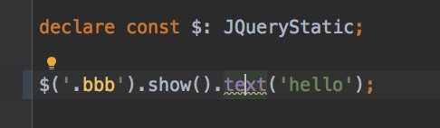
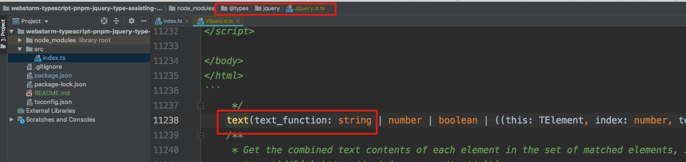
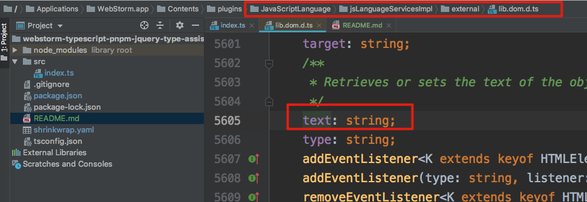

WebStorm TypeScript Pnpm Type Assisting Issue Demo
==================================================

## npm

If we use `npm`, everything is well.

```
rm -rf node_modules/
rm -rf shrinkwrap.yaml
rm -rf package-lock.json
rm -rf .idea
npm install
webstorm .
```

For code in `src/index.ts`, find declaration of `.text()`:



It will go to the correct position in `JQuery.d.ts`:



## pnpm

But if use `pnpm`, it can't find correct typing for `$dom.text()`:

```
rm -rf node_modules/
rm -rf shrinkwrap.yaml
rm -rf package-lock.json
rm -rf .idea
pnpm install
webstorm .
```

For code in `src/index.ts`, find declaration of `.text()`:


It will go to a wrong definition in `lib.dom.d.ts`:


